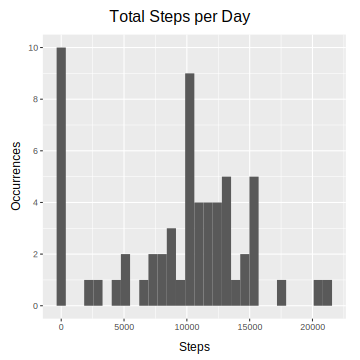
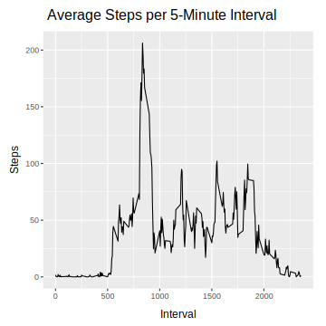
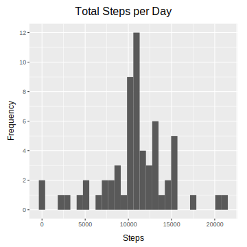
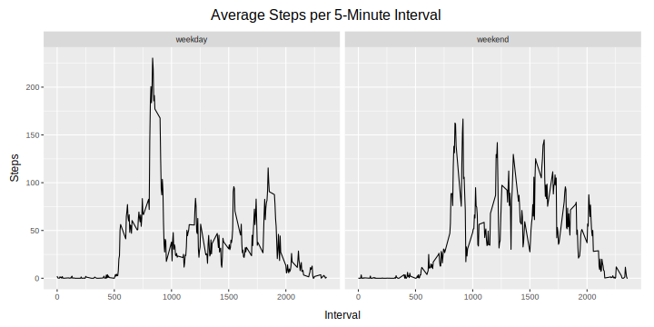

```r
library('dplyr')
library('tidyr')
library('ggplot2')
library('svglite')

mytheme = theme(axis.title = element_text(size = 12),
                axis.title.x = element_text(vjust = -2),
                axis.title.y = element_text(angle = 90, vjust = 2),
                plot.margin = margin(.5, .5, .5, .5, unit = 'cm'),
                plot.title.position = 'plot', 
                plot.title = element_text(hjust = 0.5, size = 16, vjust = 2))
```

## Loading and preprocessing the data

The data is loaded into the `activity` data frame and the `date` column is transformed to a `date` object, for ease of use.


```r
activity = read.csv('activity.csv', na.strings = 'NA',
                    colClasses = c('numeric', 'character', 'integer'))
activity$date = as.Date(activity$date)
```


## What is the mean total number of steps taken per day?

The `steps.per.day` data frame contains the sum of all steps in each day.


```r
steps.per.day = activity %>%
    group_by(date) %>%
    summarise(total.steps = sum(steps, na.rm = T))
```

This way, it's possible to make a histogram for the distribution of
the total number of steps. 


```r
ggplot(steps.per.day, aes(total.steps)) + mytheme +
    geom_histogram(bins = 30) +
    labs(x = 'Steps', y = 'Occurrences', title = 'Total Steps per Day') +
    scale_y_continuous(limits = c(0, 10), n.breaks = 6)
```



It's simple to find the mean and median of the values using their respective functions.

```r
mean(steps.per.day$total.steps)
```

```
## [1] 9354.23
```

```r
median(steps.per.day$total.steps)
```

```
## [1] 10395
```

## What is the average daily activity pattern?

The `steps.per.interval` data frame lists the mean steps taken in each interval
across all days.


```r
steps.per.interval = activity %>%
    group_by(interval) %>%
    summarise(mean.steps = mean(steps, na.rm = T))
```

With this data, it's possible to plot a time series for the mean steps.


```r
ggplot(steps.per.interval, aes(interval, mean.steps)) + mytheme +
    geom_line() + 
    labs(x = 'Interval', y = 'Steps',
         title = 'Average Steps per 5-Minute Interval') 
```



The interval with the maximum number of steps is given below. 

```r
steps.per.interval$interval[which.max(steps.per.interval$mean.steps)]
```

```
## [1] 835
```

## Imputing missing values

The number of missing values is shown below.


```r
sum(is.na(activity$steps))
```

```
## [1] 2304
```

The technique for imputing values for steps will be to use the mean value for that
interval, resulting in the `filled.activity` data frame.


```r
filled.activity = activity %>%
    inner_join(steps.per.interval, by = 'interval') %>%
    mutate(steps = coalesce(steps, mean.steps))
```

This new data frame can be used to obtain a new total for each day.


```r
filled.steps.per.day = filled.activity %>%
    group_by(date) %>%
    summarise(total.steps = sum(steps))
```

With this, we can plot a new histogram.


```r
ggplot(filled.steps.per.day, aes(total.steps)) + mytheme +
    geom_histogram(bins = 30) +
    labs(x = 'Steps', y = 'Frequency', title = 'Total Steps per Day') +  
    scale_y_continuous(limits = c(0, 12), n.breaks = 7)
```



And with this modification, there are also changes in the mean and median, increasing
both of them, since the total steps taken each day also increases with the imputation.


```r
mean(filled.steps.per.day$total.steps)
```

```
## [1] 10766.19
```

```r
median(filled.steps.per.day$total.steps)
```

```
## [1] 10766.19
```

## Are there differences in activity patterns between weekdays and weekends?

The data frame obtained previously needs to be modified to categorise the entries
as related to weekdays or weekend.


```r
filled.activity = filled.activity %>%
    mutate(type = as.factor(ifelse(
        weekdays(date, abbreviate = T) %in% c('Sat', 'Sun'),
        'weekend',
        'weekday')))
```

With this modification, we can obtain the mean number of steps for each interval in
those two scenarios.


```r
weekly.activity = filled.activity %>%
    group_by(type, interval) %>%
    summarise(mean.steps = mean(steps))
```

Finally, this values can be view in a time-series plot as shown below.


```r
ggplot(weekly.activity, aes(interval, mean.steps)) + mytheme +
    facet_wrap(. ~ type) +
    geom_path() +
    labs(x = 'Interval', y = 'Steps', title = 'Average Steps per 5-Minute Interval')
```


